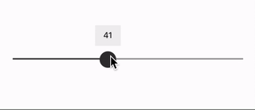
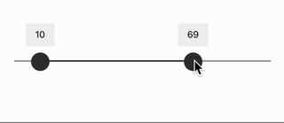

# React Native Accessible Slider

A slider that supports assistive devices, like screen readers, out of the box.

The slider can be setup to either have a single value or define a two value range (min/max).





## Getting Started

```sh
yarn add react-native-a11y-slider
```

or

```sh
npm install -S react-native-a11y-slider
```

Creates a basic slider that with a min/max slider and a total range from `1` to `100`.

```jsx
import Slider from "react-native-a11y-slider";

function Example() {
  return <Slider min={1} max={100} values={[10, 87]} />;
}
```

## Props

|     Prop name      |             Default              |       Type       |                                               Description                                               |
| :----------------: | :------------------------------: | :--------------: | :-----------------------------------------------------------------------------------------------------: |
|       values       |               [0]                |    `number[]`    |    The initial values of the sliders. If the array has two values, there will be two slider markers     |
|        min         |                                  |     `number`     |                                  The minimum value of the slider scale                                  |
|        max         |                                  |     `number`     |                                    The max value of the slider scale                                    |
|     increment      |                1                 |     `number`     |               If `min` and `max` are defined, this is the increment between slider steps.               |
|    sliderValues    |                                  |    `number[]`    |             Hardcode the slider step values. If this is used, `min` and `max` are ignored.              |
|    markerColor     |            `#333333`             |     'string'     |                            The hex color to use for the slider marker thumb.                            |
|     trackStyle     |                                  |   `ViewStyle`    |                                  A style to apply to the slider track.                                  |
| selectedTrackStyle |                                  |   `ViewStyle`    |                      A style to apply to the selected section of the slider track.                      |
|     showLabel      |              `true`              |    `boolean`     |                          Show the floating marker label over the marker thumb.                          |
|      onChange      |                                  | (values) => void |                                  Fired when the slider value changes.                                   |
|   labelComponent   |  [`src/Label`](./src/Label.tsx)  |    Component     |                            The component used for the floating marker label.                            |
|  markerComponent   | [`srv/Marker`](./src/Marker.tsx) |    Component     | The component used for the marker thumb. Note, this needs to have a static `size` property. (see below) |
| setA11yMarkerProps |                                  |     Function     |                             Customize the accessibility values (see below)                              |

## Custom Marker

You can customize the marker dot (also known as a "thumb") by passing a custom Marker Component in the props.

NOTE: In order for the slider to know how to calculate steps without unnecessary rendering flashes, your component _MUST_ define a static `size` property.

You can use [`Marker.tsx`](./src/Marker.tsx) as an example

```jsx
import React from "react";
import { View } from "react-native";
import { MarkerProps } from "react-native-a11y-slider";

function MyMarker({ color }: MarkerProps) {
  return <View style={{ backgroundColor: 'red', height: MyMarker.size, MyMarker.size }} />;
}
Marker.size = 30;
export default MyMarker;
```

```jsx
import Slider from "react-native-a11y-slider";
import MyMarker from "./MyMarker";

function SliderExample() {
  return (
    <Slider min={1} max={100} values={[10, 87]} markerComponent={MyMarker} />
  );
}
```

## Accessibility values

For a screen reader, each slider marker thumb will have the following accessibility attributes defined:

- accessibilityLabel
- accessibilityRole: 'adjustable'
- accessibilityValue
  - min
  - max
  - now
  - text
- accessibilityActions: `[{ name: "increment" }, { name: "decrement" }]`
- onAccessibilityAction: `<internal function>`

(learn more about [React Native accessibility attributes](https://reactnative.dev/docs/accessibility))

If you want to customize any of the values (except for `accessibilityActions` and `onAccessibilityAction`), you can define a `setA11yMarkerProps` callback function. This function will be called each time the marker is rendered or moved.

```jsx
import React from "react";
import Slider, {
  MarkerType,
  setA11yMarkerPropsFunctionArgs,
} from "react-native-a11y-slider";
import MyMarker from "./MyMarker";

function DistanceSlider() {
  const setA11yProps = useCallback(
    ({ markerType, value, minValue, maxValue }: setA11yMarkerPropsFunctionArgs) => {

      let accessibilityLabel = "Min distance";
      if (markerType === MarkerType.UPPER) {
        accessibilityLabel = "Max distance";
      }

      const accessibilityValue = {
        min: minValue,
        max: maxValue,
        now: value,
        text: `${value} miles`,
      },

      return {
        accessibilityLabel,
        accessibilityValue
      };
    },
    []
  );

  return (
    <Slider
      min={1}
      max={100}
      values={[10, 87]}
      setA11yMarkerProps={setA11yProps}
    />
  );
}
```
